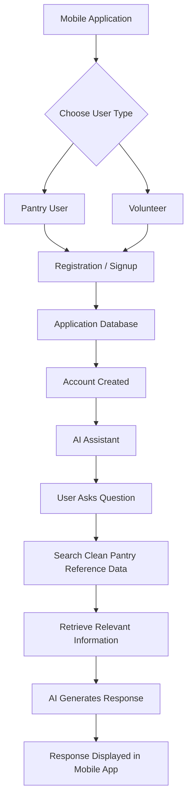

# ISU School Pantry Mobile Signup & AI Assistant

## Project Overview

This project focuses on developing a mobile application for the ISU School Pantry. The application will allow pantry users and volunteers to create accounts and complete the signup process through their phones.

The application will also include an AI assistant that can answer common questions about registration, pantry services, and volunteer opportunities. The AI assistant will use verified pantry reference information to help provide relevant responses to users.

## Data Status

This project is a new mobile application being developed from the ground up. Because the application has not yet been developed and deployed, there is currently no production application data from pantry users or volunteers.

The project currently has two categories of data: reference data that is available now and operational data that will be generated by the application later.

### Data Currently Available

The only data currently available is an initial FAQ/reference dataset containing 10 records about the School Street Food Pantry.

This dataset was manually compiled from publicly available information and organized into a structured format for the planned AI assistant. It is not user registration data, volunteer registration data, or data exported from an existing pantry application.

The raw reference dataset is located at:

`data/pantry_faq_raw.csv`

The cleaned reference dataset is located at:

`data/pantry_faq_clean.csv`

### Data Not Yet Available

Because the mobile application is being created from the ground up, actual operational data does not exist yet.

The application is expected to generate data such as:

- Pantry user registration records
- Volunteer registration records
- Volunteer signup and scheduling information
- Application usage data
- AI assistant interaction data, if interactions are stored

These records will only become available after the corresponding application features are developed and tested.

## Application Data Status

| Data Type | Purpose | Current Status |
|---|---|---|
| Pantry FAQ / Reference Data | Provides reference information for the AI assistant | Available - initial 10-record dataset collected and cleaned |
| Pantry User Registration Data | Stores information submitted by pantry users during signup | Not available yet - application is under development |
| Volunteer Registration Data | Stores information submitted by volunteers | Not available yet - application is under development |
| Volunteer Scheduling Data | Stores volunteer signup and scheduling information | Not available yet - scheduling feature has not been developed |
| AI Interaction Data | Stores AI assistant interactions if this feature requires them | Not available yet - AI assistant has not been implemented |

## Reference / Seed Data

The initial dataset is a small reference dataset created to support development of the AI assistant.

It contains information related to the School Street Food Pantry, including:

- General pantry information
- Eligibility information
- Pantry services
- Location information
- Volunteer opportunities

This dataset should be considered seed/reference data for development rather than production application data.

### Reference Data Sources

The initial reference dataset was manually compiled from publicly available Illinois State University information about the School Street Food Pantry.

Sources consulted include:

- Illinois State University Center for Civic Engagement – Civic Engagement Opportunities
- Illinois State University News – School Street Food Pantry information
- Illinois State University Redbird Life – School Street Food Pantry volunteer information

The information from these sources was manually organized into a FAQ-style CSV dataset for the prototype.

## Dataset Size

The current reference dataset contains:

**10 records and 6 columns**

The six columns are:

- `id` - unique identifier for each record
- `category` - category of pantry information
- `audience` - identifies whether the information applies to pantry users, volunteers, or both
- `question` - a common question a user may ask
- `answer` - the reference answer associated with the question
- `source` - identifies the source of the information

## Data Cleaning

The reference dataset was cleaned using a Python script located at:

`scripts/clean_data.py`

The script reads the raw CSV file and performs the following operations:

- Removes extra whitespace from values
- Standardizes the `category` field to lowercase
- Standardizes the `audience` field to lowercase
- Checks for records missing a question, answer, or source
- Checks for and removes duplicate questions
- Writes the resulting records to a new cleaned CSV file

The raw dataset contained 10 records.

After running the cleaning script:

**Raw records: 10**

**Clean records: 10**

No records were removed because none of the initial records met the script's removal conditions.

The resulting cleaned dataset is stored at:

`data/pantry_faq_clean.csv`

## Current Data Stage

The project is currently in the data planning and initial development stage.

The FAQ/reference dataset is available and has been cleaned. However, the main application-generated datasets do not exist yet because the mobile application has not yet been implemented.

As development continues, the database structure will be created for pantry users, volunteers, signup information, scheduling information, and other application-generated data.

Test or synthetic records may be created during development to test these features, but they will be clearly identified as test data rather than real pantry user data.

## Envisioned Workflow

## Planned Data Workflow

The planned data workflow for the application is:

**User → Mobile App → Registration Form → Validation → Application Database**

For AI assistance, the planned workflow is:

**User Question → AI Assistant → Pantry Reference Data → Relevant Information → AI Response → Mobile App**

The registration database and FAQ/reference dataset serve different purposes. Registration information will contain application-generated user data, while the FAQ dataset provides reference information for the AI assistant.

## Next Steps

The next phase of the project will focus on developing the mobile application.

Planned development includes:

- Creating the mobile application interface
- Creating pantry user registration
- Creating volunteer registration
- Designing the application database
- Creating volunteer signup and scheduling features
- Connecting the cleaned reference data to the AI assistant
- Testing the application with clearly labeled test data
- Expanding the reference dataset with additional verified information

As these features are developed, the status of the application-generated datasets will be updated in this repository.
